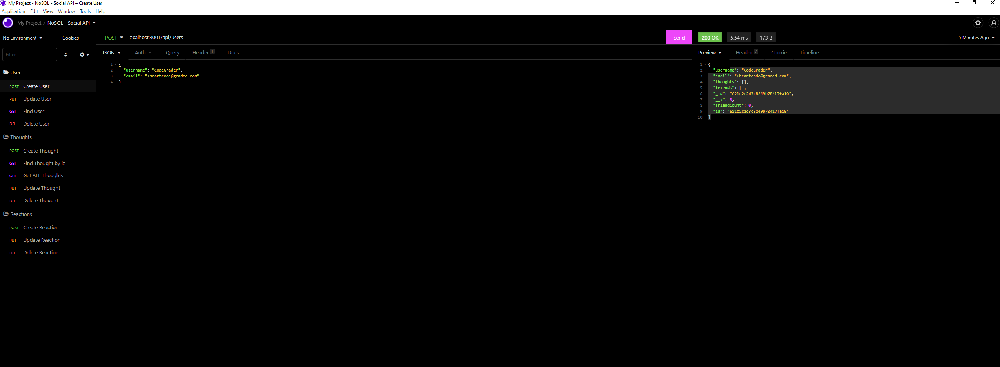
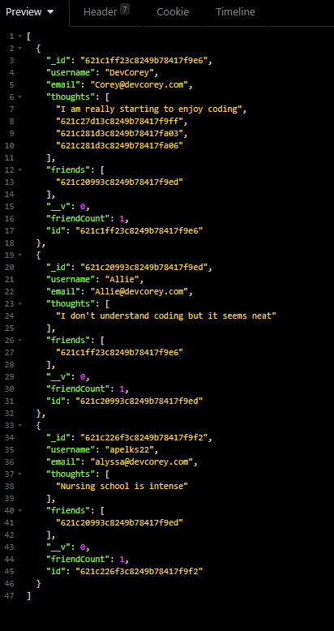
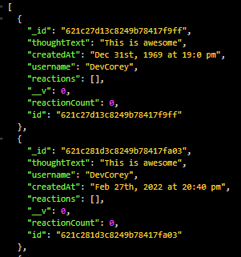

  # NoSQL Social Network API
  
  
  
  ## User Story
  ```
  AS A social media startup
  I WANT an API for my social network that uses a NoSQL database
  SO THAT my website can handle large amounts of unstructured data
  ```
  ## Acceptance Criteria
  ```
  GIVEN a social network API
  WHEN I enter the command to invoke the application
  THEN my server is started and the Mongoose models are synced to the MongoDB database
  WHEN I open API GET routes in Insomnia for users and thoughts
  THEN the data for each of these routes is displayed in a formatted JSON
  WHEN I test API POST, PUT, and DELETE routes in Insomnia
  THEN I am able to successfully create, update, and delete users and thoughts in my database
  WHEN I test API POST and DELETE routes in Insomnia
  THEN I am able to successfully create and delete reactions to thoughts and add and remove friends to a user’s friend list
  ```
  
  

  https://user-images.githubusercontent.com/87203701/155913558-d450edde-a2b6-482f-943e-5f0301246587.mp4


  ## Table-of-Contents

  * [Description](#description)
  * [Usage](#usage)
  
  * [License](#license)
    
  * [Contributing](#contributing)
  * [Questions](#questions)
  
  ## [Description](#table-of-contents)

  This is the backend of a social media site that uses Express and MongoDB. You can use all CRUD elements on USERS, THOUGHTS, REACTIONS, and even add friends.
  
  

  Clone the [repository](https://github.com/cboensch6505/NoSQLSocialNetworkAPI) and make sure express and mongoose are **installed and up to date**. The use command `npm start`   in the terminal to gewt the api up and running. 
  
  https://user-images.githubusercontent.com/87203701/155919188-143a6d24-5acf-4a61-8b3b-83240d120057.mp4
    
  Now navigate to Insomnia where you can use `localhost:3001/api` to access the api.

  ## [Usage](#table-of-contents)

  `localhost:3001/api/users` and `localhost:3001/api/thoughts` will give you all you need when using GET, POST, PUT, & DELETE functions with respective USER and THOUGHT id's. As   well as ADD and DELETE friends as shown in the video below.
  
  https://user-images.githubusercontent.com/87203701/155918261-5f43a84b-3361-48ea-945f-17fa9709f9fe.mp4
  
  
  
  
  
  
  ## [License](#table-of-contents)

  The application is covered under the following license:

  
  [mit](https://choosealicense.com/licenses/mit)
    
    

  ## [Contributing](#table-of-contents)
  
  
  Thank you for your interest in helping out; however, I will not be accepting contributions from third parties.
    

  ## [Questions](#table-of-contents)

  Please contact me using the following links:

  [GitHub](https://github.com/cboensch6505)

  [Email: cboensch6505@gmail.com](mailto:cboensch6505@gmail.com)
